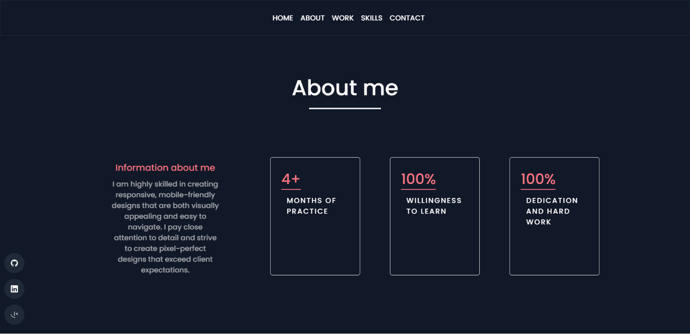
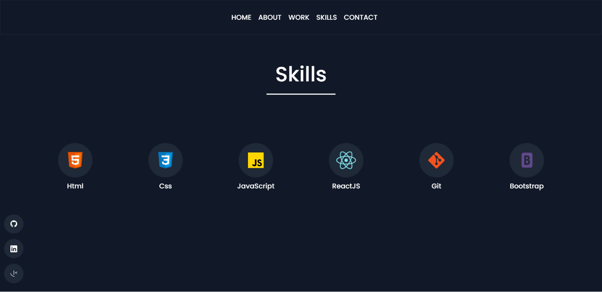

## Portfolio
This is my new portfolio website. 

## Built With

This project was built using these technologies:

- React.js
- HTML
- CSS
- MailJs
- Netlify

## 🛠 Installation and Setup Instructions

1. Installation: `npm install`

2. Create `.env` file and add your own MailJS templete , service and user IDs 

3. In the project directory, you can run: `npm start`

Runs the app in the development mode.\
Open [http://localhost:3000](http://localhost:3000) to view it in the browser.
The page will reload if you make edits.

# [Live Website Preview](https://malekbentaher.netlify.app/)

