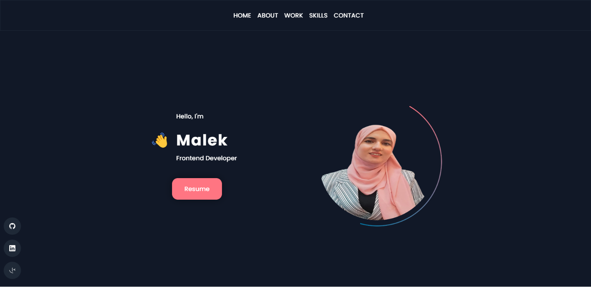
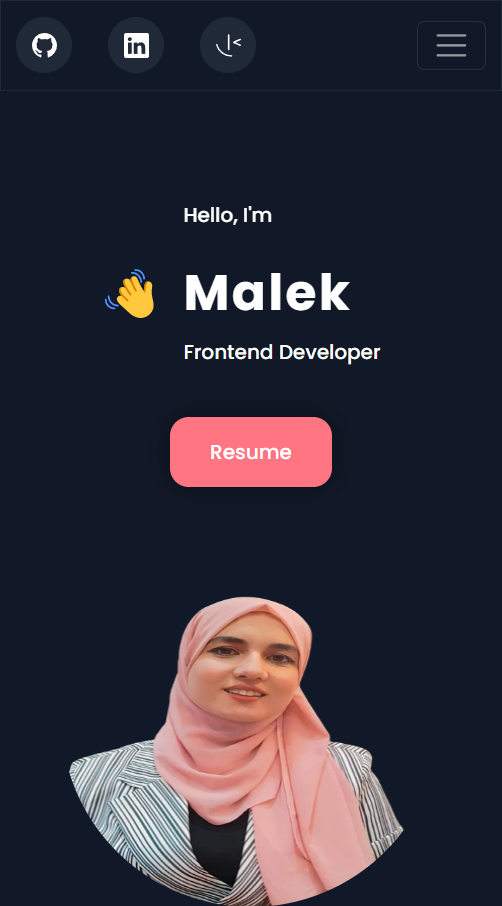

## Portfolio
Welcome to my portfolio website! This website was built using ReactJS and Framer Motion for scroll animations. It showcases my projects, skills, and experience as a developer.

## Built With

This project was built using these technologies:

- React.js
- HTML
- CSS
- Framer Motion
- MailJs
- Netlify

## 🛠 Installation and Setup Instructions

1. Installation: `npm install`

2. Create `.env` file and add your own MailJS templete , service and user IDs 

3. In the project directory, you can run: `npm start`

Runs the app in the development mode.\
Open [http://localhost:3000](http://localhost:3000) to view it in the browser.
The page will reload if you make edits.

## Navigation

The website has a navigation bar that allows users to easily navigate between different sections. The sections include:

- Home: A brief introduction to who I am and what I do.
- About: More detailed information about my background.
- Works: A showcase of my recent projects, including links to live demos and GitHub repositories.
- Skills: A list of the programming languages, frameworks, and tools that I'm proficient in.
- Contact: A form where users can send me a message.

## Demo

Check out the live demo of my portfolio at https://malekbentaher.netlify.app/

## Screenshots

### Home page

|  |  |
| ------------------------------ | ----------------------------- |
| Desktop version                | Mobile version                |

### About page

|  |  |
| ------------------------------ | ----------------------------- |
| Desktop version                | Mobile version                |

### Work page

|  |  |
| ------------------------------ | ----------------------------- |
| Desktop version                | Mobile version                |

### Skills page

|  |  |
| ------------------------------ | ----------------------------- |
| Desktop version                | Mobile version                |

### Contact page

|  |  |
| ------------------------------ | ----------------------------- |
| Desktop version                | Mobile version                |

